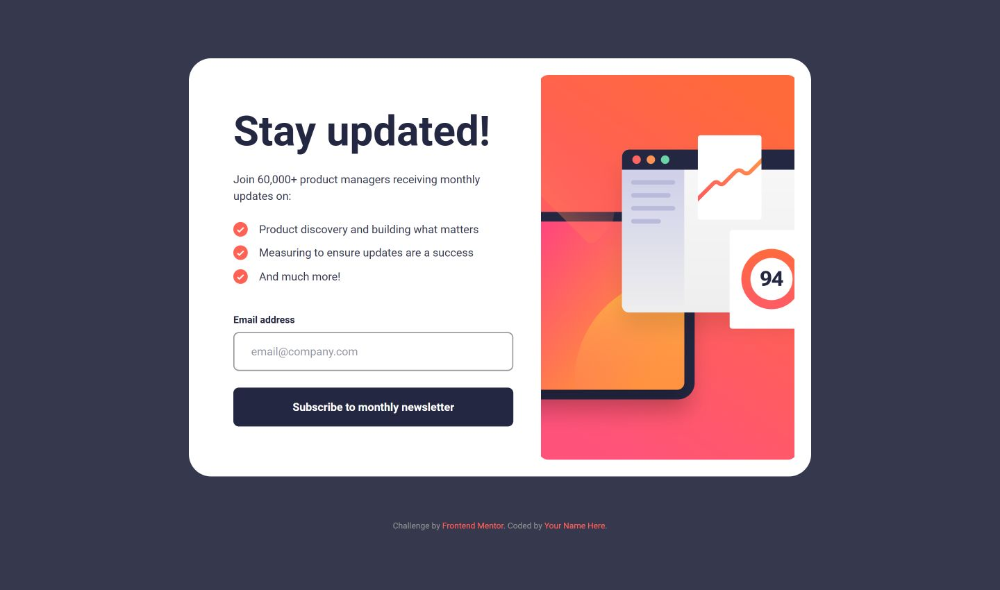

# Frontend Mentor - Newsletter sign-up form with success message solution

This is a solution to the [Newsletter sign-up form with success message challenge on Frontend Mentor](https://www.frontendmentor.io/challenges/newsletter-signup-form-with-success-message-3FC1AZbNrv). Frontend Mentor challenges help you improve your coding skills by building realistic projects.

## Table of contents

- [Overview](#overview)
  - [The challenge](#the-challenge)
  - [Screenshot](#screenshot)
  - [Links](#links)
- [My process](#my-process)
  - [Built with](#built-with)
  - [What I learned](#what-i-learned)
  - [Continued development](#continued-development)
  - [Useful resources](#useful-resources)
- [Author](#author)

## Overview

### The challenge

Users should be able to:

- Add their email and submit the form
- See a success message with their email after successfully submitting the form
- See form validation messages if:
  - The field is left empty
  - The email address is not formatted correctly
- View the optimal layout for the interface depending on their device's screen size
- See hover and focus states for all interactive elements on the page

### Screenshot



### Links

- Solution URL: [Github](https://github.com/bahauddinmandal/newsletter-sign-up-with-success-message)
- Live Site URL: [Netlify](https://bahauddinmandal-fm09.netlify.app/)

## My process

### Built with

- Semantic HTML5 markup
- CSS Custom Properties
- Flexbox & CSS Grid
- Mobile-first workflow
- **[Tailwind CSS v4](https://tailwindcss.com/)** - The latest version of the utility-first CSS framework
- **[Vite](https://vitejs.dev/)** - Next Generation Frontend Tooling
- Vanilla JavaScript

### What I learned

This project was a deep dive into the new **Tailwind CSS v4** configuration. I learned how to define theme variables directly in the CSS file using the `@theme` block instead of the traditional `tailwind.config.js`.

I also implemented custom CSS animations for the error states and success message pop-up.

**Key Code Snippet: Tailwind v4 Theme Configuration**

```css
@theme {
  --color-primary: hsl(4, 100%, 67%);
  --font-roboto: "Roboto", sans-serif;

  /* Custom Animation Definition */
  @keyframes shake {
    0%,
    100% {
      transform: translateX(0);
    }
    10%,
    30%,
    50%,
    70% {
      transform: translateX(-8px);
    }
    20%,
    40%,
    60% {
      transform: translateX(8px);
    }
  }
}
```

### Continued development

In future projects, I want to continue exploring complex animations and perhaps re-build this component using a framework like React or Next.js to handle state management more efficiently.

### Useful resources

- [Animista](https://animista.net/) - This library was incredibly helpful for generating the custom CSS keyframes. I used it to create the "shake" animation for the error state and the "bounce" effect for the success icon.
- [Tailwind CSS v4 Documentation](https://tailwindcss.com/docs/installation) - Since I used the latest version (v4), the official documentation was essential for understanding the new CSS-first configuration and how to use the `@theme` directive properly.
- [MDN Web Docs - Form Validation](https://developer.mozilla.org/en-US/docs/Learn/Forms/Form_validation) - This is my go-to reference for semantic HTML. It helped me understand the correct way to handle client-side email validation and how to use ARIA attributes like `aria-invalid` for better accessibility.

## Author

- email - [bahauddin.one@gmail.com](mailto:bahauddin.one@gmail.com)
- Frontend Mentor - [@bahauddinmandal](https://www.frontendmentor.io/profile/bahauddinmandal)
- twitter - [@bahauddinmandal](https://x.com/bahauddinmandal)
